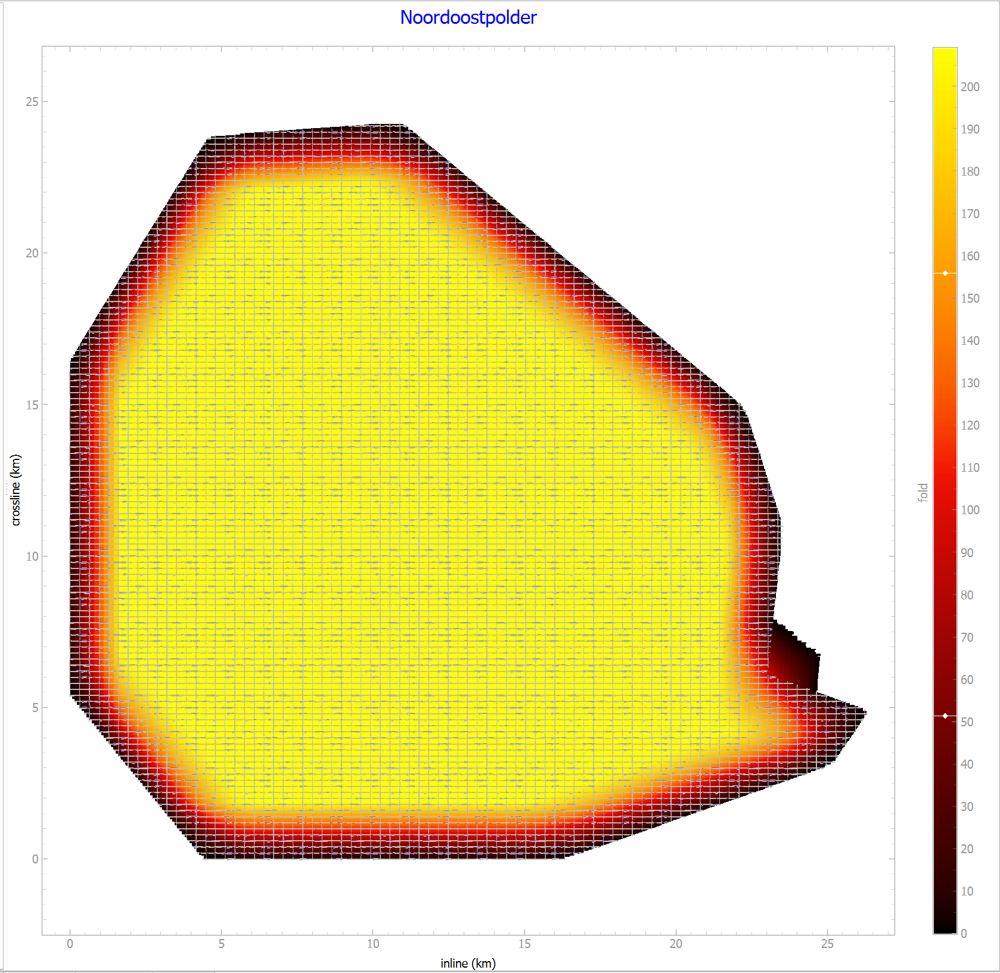

# Roll Samples

### Example projects for the QGIS Seismic survey design plugin 'Roll'

#### 1	Introduction

This repository contains a number of example projects for '**Roll**'. 

Several basic geometries are shown in the following sample files:

- In the **generic** folder:

  - Abtswoudsebrug_001
  - Brick_001
  - DipTest_001
  - DoubleZigzag_001
  - Orthogonal_001
  - Parallel_001
  - SphereTest_001
  - TripleZigzag_001


- In the **marine** folder
  
  - Marine_001

- In the **orthogonal** folder

  - 400x400_20x20_6kmx6km
  - 400x400_40x40_6kmx6km
  - 400x400_40x40_6kmx6km_repeated_cross_spreads

  
- In the **Noordoostpolder** folder:
  - Noordoostpolder (*a fully worked out example showing interaction with QGIS*)

- In the **wells** folder, some well based templates (*in conjunction with circles and spirals*):
  - VSP-spiral-well
  - Wells-well
  - Wells-wws


#### 2	Well based seeds

The templates that are using  **well based seeds**  are referring to external "**well files**"

These are ascii files for which two formats are currently supported:

- ***.wws**	GeoPath (ahd, inc, azi) deviation format 
- ***.well**	OpendTect (x, y, z) format

The **GeoPath** (ahd, inc, azi) deviation trajectory is resampled to local (x, y, z) values for specified along-hole positions using the minimum curvature approach. 

The **OpendTect** (x, y, z) format is first converted into a deviation format, before resampling specified along-hole positions to local (x, y, z) values, using the minimum curvature approach. This minimizes position errors related to a curved well trajectory.

##### 2.1	Well File locations

Upon loading a Roll project, the **well files** are checked for having a 'relative' well path' (instead of an 'absolute path'). These relative paths are then converted to an absolute path, to access the information in the well files. When saving the edited project, the well files are included in the project file using a relative path. This makes it easier to move the roll project file and its associated well files into a different folder. Note: In Roll's settings dialog, there is an option to always use absolute paths when saving a project file. 

##### 2.2	Circles and Spirals

The  wells projects listed above, not only contain well-based seeds but also contain some **circle** and **spiral** based seeds, that may be used when acquiring a 3D VSP


#### 3.	Survey wizards

**Land** and **marine** surveys can be created using two separate wizards, that takes you through the different steps of defining the block(s), template(s) and grow factors. 

##### 3.1 Land surveys

The land survey wizard supports various types of survey geometries. Some designs are no longer in use (e.g. brick and zigzag) but these are included for completeness.  The different types that are supported are:

1. Orthogonal
2. Parallel
3. Slanted
4. Brick
5. Zigzag

##### 3.2.	Marine surveys

The marine survey wizard honours minimal turning radius for the inner streamers (*using a minimal towing speed to keep the spread stable*) and a maximal turning radius for the outer streamer(s) (*based on maximum allowed towing forces the streamers can handle*).  Theory for this was developed in the thesis `Simplified Modeling of Seimic Survey Vessels to Determine Optimaal Maneuver Patterns` by Caio de Araujo Ferraz de Carvalho. Where formulas were not explicitly given, they have been reversed engineered, and checked against the numerous figures present in the thesis.

In a towed marine survey, there is only one shot per template as the vessel moves, waiting for the next shot to be taken with a different source at a different location. Furthermore, data is acquired in 'racetracks' whereby east EW sail line is followed by a WE sail line acquired at a distance. The optimal number of sail lines in a racetrack is determined by the optimal turning radius, avoiding turns that are too tight ('tear drops') or turns that are too wide ('crossline sailing'). The wizard takes all of this into account when selecting optimal number of lines per race track.


#### 4	Noordoostpolder example

This example starts with defining an orthogonal template that is converted into geometry files. These geometry files are then exported to QGIS for further editing (enabling / disabling / deletion / move points around). 

An example of editing is selecting the region where the sources and receivers can be active, as a 'real' survey area is rarely 'purely a rectangle'

The editing process is described in detail in a html file accessible from the help menu in Roll: 

```Help --> QGis-Roll interface (Ctrl+H)```

Once editing is completed, the points can be re-imported into Roll for analysis of the fold map, as well as creating minimum- / maximum offset charts. These figures can then be exported to QGIS as georeferenced tiff files, so the results of the edits are displayed in QGIS itself at the proper location in space.

See example figure below for usage of the interaction between Roll and QGis.




Figure 1. Noordoostpolder fold map, displayed in Roll

